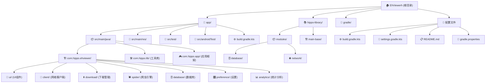

# EhViewerh 项目架构文档

> 最后更新：2025-09-10 19:36:48

## 变更记录 (Changelog)

### 2025-09-10
- **初始化架构文档**: 完成项目结构分析和模块索引
- **生成模块结构图**: 创建了完整的Mermaid结构图展示项目架构
- **建立文档体系**: 为主要模块创建了独立的CLAUDE.md文档

---

## 项目愿景

EhViewerh 是一个功能强大的Android图片瀏覽器应用，专为台湾用户优化。该项目基于EhViewer二次开发，集成了：

- **专业图片浏览**: 多格式支持、高质量渲染、智能缓存
- **内建浏览器引擎**: 腾讯X5 WebView + 原生WebView双核心支持  
- **完整文件管理**: 文件浏览、多媒体播放、APK安装
- **画廊系统**: 多源浏览、标签管理、收藏同步
- **用户脚本支持**: 20+ 预设增强脚本，Tampermonkey兼容

## 架构总览

### 技术栈
- **平台**: Android 6.0+ (API 23)
- **语言**: Java + Kotlin混合开发
- **构建**: Gradle 8.x + Android Gradle Plugin
- **架构**: 单模块Android应用，采用分层架构设计

### 核心依赖
```kotlin
// 网络层
implementation("com.squareup.okhttp3:okhttp:3.14.7")
implementation("org.jsoup:jsoup:1.15.3")

// 浏览器引擎  
implementation("com.tencent.tbs:tbssdk:44286")

// 数据层
implementation("org.greenrobot:greendao:3.0.0")

// UI组件
implementation("androidx.appcompat:appcompat:1.7.0")
implementation("com.google.android.material:material:1.12.0")

// 分析统计
implementation("com.google.firebase:firebase-analytics:22.4.0")
```

---

## 模块结构图



---

## 模块索引

| 模块路径 | 职责描述 | 语言 | 测试覆盖 | 状态 |
|----------|----------|------|----------|------|
| [app/](./app/CLAUDE.md) | 主应用模块：UI、业务逻辑、资源文件 | Java/Kotlin | ✅ 单元测试 + 集成测试 | 🟢 活跃 |
| [hippo-library/modules/database/](./hippo-library/modules/database/CLAUDE.md) | 数据库管理模块：配置、迁移、帮助类 | Java | ❌ 需要测试 | 🟡 维护 |
| [hippo-library/modules/network/](./hippo-library/modules/network/CLAUDE.md) | 网络工具模块：配置、异常处理、工具类 | Java | ❌ 需要测试 | 🟡 维护 |
| [hippo-library/main-base/](./hippo-library/main-base/CLAUDE.md) | 基础应用框架：示例和通用组件 | Kotlin | ❌ 需要测试 | 🟡 维护 |

### 图例
- 🟢 活跃：频繁开发和维护
- 🟡 维护：稳定状态，偶尔更新
- 🔴 废弃：不再维护，计划移除

---

## 运行与开发

### 环境要求
- **JDK**: Java 17
- **Android Studio**: 2024.1+
- **Gradle**: 8.x
- **Android SDK**: 编译SDK 35，最小SDK 23

### 快速启动
```bash
# 克隆项目
git clone https://github.com/loututu114-pixel/ehviewer.git
cd EhViewerh

# Debug构建
./gradlew app:assembleDebug

# Release构建（需要签名配置）
./gradlew app:assembleRelease
```

### 渠道构建
```bash
# 指定渠道代码构建
./gradlew app:assembleRelease -PCHANNEL_CODE=3001
```

### 开发服务器
```bash
# 启动开发服务器（如有）
./gradlew app:bootRun
```

---

## 测试策略

### 测试分层
- **单元测试**: 位于`src/test/`，测试业务逻辑和工具类
- **集成测试**: 位于`src/androidTest/`，测试UI和系统集成
- **性能测试**: 专门的性能测试类

### 测试运行
```bash
# 单元测试
./gradlew test

# Android设备测试  
./gradlew connectedAndroidTest

# 特定测试类
./gradlew test --tests "*.NetworkDetectorUnitTest"
```

### 测试覆盖范围
- ✅ 网络层测试（NetworkDetectorUnitTest）
- ✅ UI输入验证测试（InputValidatorTest）
- ✅ 渠道统计测试（ChannelTrackerRetryTest）
- ✅ 画廊优化测试（GalleryListOptimizationTest）
- ❌ 浏览器引擎测试（需要补充）
- ❌ 文件管理测试（需要补充）

---

## 编码规范

### Java/Kotlin混合开发规范
- **新功能**: 优先使用Kotlin开发
- **现有Java代码**: 维护时可考虑重构为Kotlin
- **接口设计**: 确保Java/Kotlin互操作性

### 命名约定
- **类名**: PascalCase (EhApplication, MainActivity)
- **方法名**: camelCase (getEhClient, initializeWebView)
- **常量**: UPPER_SNAKE_CASE (DEBUG_PRINT_INTERVAL)
- **资源ID**: snake_case (activity_main, ic_launcher)

### 代码组织
- **包结构**: 按功能模块分包（ui, client, download等）
- **Activity**: 继承EhActivity，统一生命周期管理
- **Fragment**: 使用androidx.fragment包
- **服务**: 继承适当的Service基类

### 异常处理
```java
// 统一使用ExceptionUtils处理
try {
    // 业务逻辑
} catch (Throwable t) {
    ExceptionUtils.throwIfFatal(t);
    // 错误处理逻辑
}
```

---

## AI使用指引

### Claude使用最佳实践

#### 代码分析任务
- 使用`file-analyzer`子代理分析日志文件和复杂输出
- 使用`code-analyzer`子代理进行代码搜索、分析和漏洞检测
- 使用`test-runner`子代理运行测试并分析结果

#### 开发指导原则
- **最小化变更**: 实施最简洁的解决方案，尽量少改代码
- **禁止部分实现**: 不允许简化或未完成的实现
- **复用优先**: 检查现有代码库，重用现有函数和常量
- **测试驱动**: 为每个新功能实现对应的测试
- **准确测试**: 测试必须准确反映真实使用场景并能发现缺陷

#### 架构决策
- **无过度工程**: 避免不必要的抽象和企业级模式
- **关注分离**: 保持验证、API处理、数据库操作的清晰分离
- **资源管理**: 确保数据库连接、超时、事件监听器的正确清理

#### 问题诊断流程
1. 使用`file-analyzer`分析错误日志
2. 使用`code-analyzer`定位问题代码
3. 使用`test-runner`验证修复方案
4. 确保修复不影响现有功能

---

## 数据库设计

### 主要数据表
- **下载记录**: download_* 系列表
- **画廊信息**: gallery_* 系列表  
- **用户设置**: settings表
- **历史记录**: history表
- **书签收藏**: bookmark表

### 数据库版本管理
- 使用GreenDAO进行对象映射
- 数据库迁移在EhDB中统一管理
- 支持旧版本数据库的平滑升级

---

## 网络架构

### HTTP客户端配置
- **主客户端**: OkHttpClient，用于API请求
- **图片客户端**: ImageOkHttpClient，专用于图片加载
- **连接池**: 支持Keep-Alive优化
- **DNS**: 自定义EhHosts进行域名解析
- **缓存**: 50MB HTTP缓存 + 动态磁盘缓存

### 网络优化策略
- 带宽自适应管理（BandwidthManager）
- 连接失败自动重试
- Cookie与WebView同步
- SSL/TLS安全增强

---

## 性能优化

### 内存管理
- 基于设备内存的动态缓存大小调整
- LRU缓存策略用于图片和画廊详情
- 内存压力时自动清理缓存
- 图片解码优化和预加载

### 启动优化  
- WebView预加载提升浏览器启动速度
- 系统服务兼容性处理
- 启动日志记录和性能监控
- 异步初始化非关键组件

### UI性能
- 硬件加速优化
- OpenGL渲染兼容性处理
- Ripple效果兼容性修复
- 主题系统预初始化

---

## 安全与隐私

### 权限管理
- 存储权限（文件管理功能必需）
- 网络权限（应用核心功能）
- 位置权限（浏览器功能可选）
- 生物识别权限（安全功能可选）

### 数据安全
- SSL证书校验
- Cookie安全存储
- 用户数据加密
- 崩溃日志隐私保护

### 隐私保护
- 可选的分析统计
- 本地数据优先
- 最小化数据收集
- 用户控制数据清理

---

## 国际化支持

### 支持语言
- 中文（简体、繁体、香港、台湾）
- 英语、日语、韩语
- 西班牙语、法语、德语、泰语

### 本地化策略
- Android标准资源本地化
- 动态语言切换支持
- 地区特定的默认设置
- 用户环境自动检测

---

## 发布与分发

### 构建变体
- **Debug**: 开发调试版本，包含调试信息
- **Release**: 正式发布版本，代码混淆和优化

### 渠道管理
- **渠道0000**: 默认版本，适合一般用户
- **渠道3001**: 合作渠道版本，包含渠道统计

### APK签名
- 统一的release签名配置
- 环境变量或gradle.properties配置
- 构建前的签名验证机制

### 版本发布流程
1. 代码审查和测试
2. 版本号更新和changelog
3. 构建和签名APK
4. 发布到GitHub Releases
5. 渠道统计数据监控

---

<div align="center">

**EhViewerh 项目架构文档** - 版本2.0.0.5  
基于Claude架构师自适应分析生成

[⬆ 回到顶部](#ehviewerh-项目架构文档)

</div>