# EhViewer Android 项目文档

> 功能强大的Android图片浏览器应用，集成完整浏览器功能、用户脚本系统、文件管理等特性

## 变更记录 (Changelog)

### 2025-09-06 03:01:06 - AI上下文架构刷新
- 深度扫描并更新项目架构文档
- 重新识别核心模块结构和依赖关系
- 刷新模块索引表和Mermaid结构图
- 补充新增模块（浏览器、文件管理、用户脚本等）的详细信息
- 更新技术栈和依赖信息（基于build.gradle.kts v2.0.0.1）

### 2025-09-04 15:06:50 - 项目架构文档初始化
- 生成项目整体架构文档
- 创建模块结构图和索引
- 建立AI上下文管理系统

## 项目愿景

EhViewer是一个多功能的Android应用，主要专注于：
- **图片浏览**：高效的画廊浏览和管理体验（核心功能）
- **内置浏览器**：功能完整的WebView浏览器，支持各种网页标准，腾讯X5内核增强
- **用户脚本系统**：类似Tampermonkey的脚本管理，支持网站增强和自定义功能（20+预置脚本）
- **文件管理**：支持多种文件格式的查看和管理（APK安装、多媒体播放等）
- **渠道定制**：支持多渠道打包和统计分析（当前渠道3001）

## 架构总览

### 技术栈
- **语言**: Java + Kotlin (JDK 17)
- **平台**: Android (minSdk 23, targetSdk 34, compileSdk 35)
- **架构模式**: MVP + Repository Pattern + EventBus
- **UI框架**: AndroidX + Material Design + ViewBinding
- **网络**: OkHttp3 3.14.7 + 自定义DNS和代理 + Conscrypt SSL
- **数据库**: GreenDAO 3.0.0
- **浏览器内核**: 腾讯X5 WebView (TBS SDK 44286) + 原生WebView备用
- **分析**: Firebase Analytics + Crashlytics
- **用户脚本**: JavaScript引擎 + Tampermonkey兼容API
- **文件处理**: 7Zip支持 + UniFile抽象层
- **图片处理**: Conaco + 自定义BitmapHelper + PNG原生库

### 架构分层
```
┌─────────────────────────────────────┐
│           UI Layer                   │
│  Activities (39个) │ Fragments │ Widgets │
├─────────────────────────────────────┤
│         Business Layer              │
│  EhEngine │ Managers │ Services     │
├─────────────────────────────────────┤
│          Data Layer                 │
│ GreenDAO │ EhClient │ Cache │ Files │
├─────────────────────────────────────┤
│       User Script Layer            │
│  ScriptEngine │ Injector │ Assets  │
├─────────────────────────────────────┤
│         Native Layer                │
│  JNI │ C++ Components │ A7Zip │ PNG │
└─────────────────────────────────────┘
```

## 模块结构图

```mermaid
graph TD
    A["(根) EhViewer"] --> B["app"];
    B --> C["ui"];
    B --> D["client"];
    B --> E["gallery"];
    B --> F["download"];
    B --> G["spider"];
    B --> H["assets"];
    B --> I["widget"];
    B --> J["dao"];
    B --> K["util"];
    B --> L["preference"];

    C --> C1["MainActivity (主入口)"];
    C --> C2["WebViewActivity (浏览器)"];
    C --> C3["GalleryActivity (画廊)"];
    C --> C4["FileManagerActivity (文件管理)"];
    C --> C5["39个Activity总计"];
    
    D --> D1["EhEngine (核心引擎)"];
    D --> D2["EhClient (HTTP客户端)"];
    D --> D3["parser (HTML解析器)"];
    D --> D4["EhCookieStore (Cookie管理)"];
    
    E --> E1["GalleryProvider (画廊提供者)"];
    E --> E2["ArchiveGalleryProvider (压缩包)"];
    E --> E3["DirGalleryProvider (目录)"];
    
    F --> F1["DownloadManager (下载管理)"];
    F --> F2["DownloadService (后台服务)"];
    
    G --> G1["SpiderDen (爬虫管理)"];
    G --> G2["SpiderQueen (爬虫调度)"];
    
    H --> H1["20+用户脚本"];
    H --> H2["广告拦截脚本"];
    H --> H3["站点优化脚本"];
    
    I --> I1["自定义控件库"];
    I --> I2["EhDrawerView等"];
    
    J --> J1["GreenDAO实体"];
    J --> J2["数据访问对象"];
    
    K --> K1["工具类集合"];
    K --> K2["系统兼容性"];

    click C1 "./app/src/main/java/com/hippo/ehviewer/ui/MainActivity.java" "查看主Activity"
    click C2 "./app/src/main/java/com/hippo/ehviewer/ui/WebViewActivity.java" "查看浏览器Activity"
    click D1 "./app/src/main/java/com/hippo/ehviewer/client/EhEngine.java" "查看EhEngine核心引擎"
    click D2 "./app/src/main/java/com/hippo/ehviewer/client/EhClient.java" "查看HTTP客户端"
    click H1 "./app/src/main/assets/" "查看用户脚本资源"
```



## 模块索引

| 模块路径 | 职责描述 | 主要组件 | 文件数量 | 状态 |
|---------|---------|---------|---------|------|
| **app** | 主应用模块 | EhApplication, Settings, AppConfig | 13个核心类 | ✅ 活跃 |
| **app/ui** | 用户界面层 | 39个Activity, MainActivity, WebViewActivity | 39个Activity | ✅ 活跃 |
| **app/client** | 网络客户端层 | EhEngine, EhClient, EhCookieStore, 解析器 | 20+个类 | ✅ 活跃 |
| **app/gallery** | 画廊系统 | GalleryProvider家族, A7ZipArchive | 6个提供者 | ✅ 活跃 |
| **app/download** | 下载管理系统 | DownloadManager, DownloadService | 核心服务 | ✅ 活跃 |
| **app/spider** | 爬虫系统 | SpiderDen, SpiderQueen, SpiderInfo | 爬虫引擎 | ✅ 活跃 |
| **app/dao** | 数据访问层 | GreenDAO生成类, 实体对象 | 15+个DAO | ✅ 活跃 |
| **app/widget** | 自定义控件 | EhDrawerView, GalleryHeader等 | 40+个组件 | ✅ 活跃 |
| **app/util** | 工具类库 | 系统兼容性, 文件处理, 图形处理 | 30+个工具类 | ✅ 活跃 |
| **app/assets** | 用户脚本资源 | 20+个预置增强脚本 | 20个JS脚本 | ✅ 活跃 |
| **app/preference** | 偏好设置 | 各种设置Activity的Preference | 10+个偏好类 | ✅ 活跃 |

## 核心特性

### 🌐 内置浏览器功能
- **双内核**: 腾讯X5 WebView + 原生WebView备用
- **完整浏览器**: 地址栏、书签、历史记录、多标签页
- **用户脚本支持**: 20+预置脚本，Tampermonkey兼容
- **密码管理**: 自动填充和密码存储
- **下载管理**: 集成下载器，支持后台下载
- **文件处理**: APK安装、媒体播放、文档查看

### 🔧 用户脚本系统
- **脚本引擎**: JavaScript执行环境
- **预置脚本**: 
  - `universal_ad_blocker.js` - 通用广告拦截
  - `baidu_app_blocker.js` - 百度应用拦截
  - `video_player_enhancer.js` - 视频播放增强
  - `bilibili_enhancer.js` - B站功能增强
  - `zhihu_enhancer.js` - 知乎体验优化
  - 等20+个增强脚本
- **自动注入**: 根据URL规则自动加载对应脚本
- **动态更新**: 支持脚本热更新和管理

### 📱 多媒体文件支持
- **图片查看**: 支持常见格式，缩放、旋转、幻灯片
- **视频播放**: 内置播放器，支持多种编码格式
- **音频播放**: 后台播放支持
- **文档查看**: PDF、Office文档预览
- **压缩包**: 7Zip支持，可直接浏览内容
- **APK安装**: 应用安装器功能

### 📂 文件管理器
- **完整功能**: 文件浏览、复制、移动、删除
- **多种视图**: 列表、网格、详细信息
- **快速搜索**: 文件名和内容搜索
- **云存储**: 支持外部存储访问
- **权限管理**: Android 11+存储权限适配

### 🎯 画廊系统 (核心功能)
- **多源支持**: 网络画廊、本地压缩包、目录浏览
- **智能缓存**: 图片预加载和磁盘缓存
- **下载管理**: 批量下载、断点续传
- **标签系统**: 用户标签、黑名单过滤
- **收藏系统**: 本地收藏和云同步

## 运行与开发

### 环境要求
- **Android Studio**: Arctic Fox+ (推荐最新版)
- **JDK**: 17 (必需)
- **Android SDK**: 35 (compileSdk)
- **NDK**: 最新版本 (用于native组件和7Zip)
- **Git**: 用于版本控制

### 构建步骤
```bash
# 克隆项目
git clone <repository-url>
cd EhViewerh

# 清理构建
./gradlew clean

# 构建Debug版本
./gradlew assembleDebug

# 构建Release版本 (带签名)
./gradlew assembleRelease

# 多渠道构建
./gradlew assembleAppReleaseRelease
```

### 渠道配置
在 `app/build.gradle.kts` 中修改 `CHANNEL_CODE` 来切换渠道：
```kotlin
buildConfigField("String", "CHANNEL_CODE", "\"3001\"")  // 当前渠道
```

### 依赖管理
主要依赖库 (基于build.gradle.kts v2.0.0.1)：
```kotlin
// 核心AndroidX
implementation("androidx.core:core-ktx:1.15.0")
implementation("androidx.appcompat:appcompat:1.7.0")

// 网络和解析
implementation("com.squareup.okhttp3:okhttp:3.14.7")
implementation("org.jsoup:jsoup:1.15.3")

// 数据库
implementation("org.greenrobot:greendao:3.0.0")

// 浏览器内核
implementation("com.tencent.tbs:tbssdk:44286")

// Native库
implementation("com.github.seven332.a7zip:extract-lite:1b21783")
implementation("com.fpliu.ndk.pkg.prefab.android.21:libpng:1.6.37")
```

### 重要提醒
- ⚠️ **APK必须带签名才能安装** - 使用 `assembleRelease`
- ⚠️ **NDK组件依赖** - 确保NDK已正确安装
- ⚠️ **X5内核初始化** - 首次运行需要下载X5内核
- ⚠️ **存储权限** - Android 11+需要MANAGE_EXTERNAL_STORAGE权限

## 测试策略

### 单元测试
- **位置**: `app/src/test/`
- **框架**: JUnit 4 + Robolectric + Mockito
- **覆盖**: 核心业务逻辑、工具类、数据访问层
- **模拟**: 网络请求、文件系统、系统服务

### 集成测试  
- **位置**: `app/src/androidTest/`
- **框架**: Espresso + AndroidX Test
- **覆盖**: UI交互、Activity生命周期、权限处理
- **设备**: 需要真实设备或模拟器

### 测试执行
```bash
# 运行单元测试
./gradlew test

# 运行特定测试类
./gradlew testDebugUnitTest --tests="*.EhEngineTest"

# 运行集成测试 (需要设备/模拟器)
./gradlew connectedAndroidTest

# 生成测试报告
./gradlew testDebugUnitTest jacocoTestReport
```

## 编码规范

### Java/Kotlin规范
- **官方风格**: 遵循Android官方代码风格
- **库使用**: AndroidX库，避免Support库
- **语言选择**: 新功能优先Kotlin，兼容性考虑Java
- **命名约定**: 
  - Activity: `*Activity.java`
  - Fragment: `*Fragment.java` 
  - Manager: `*Manager.java`
  - Utils: `*Utils.java`

### 资源命名
- **布局文件**: 
  - Activity: `activity_*.xml`
  - Fragment: `fragment_*.xml` 
  - 控件: `widget_*.xml`
  - 列表项: `item_*.xml`
- **图标资源**: `ic_*.xml` / `v_*_x*.xml`
- **颜色资源**: 语义化命名 (primary、secondary、error等)
- **字符串**: 模块前缀 + 功能描述

### 架构原则
- **分层解耦**: UI、Business、Data严格分离
- **Repository模式**: 统一数据访问接口
- **Manager封装**: 复杂业务逻辑集中管理
- **Service后台**: 长时间任务使用Service
- **EventBus通信**: 组件间异步通信
- **依赖注入**: 避免硬编码依赖关系

## AI使用指引

### 上下文优化
- **项目索引**: 使用 `.claude/index.json` 快速了解项目结构
- **模块文档**: 每个模块都有对应的 `CLAUDE.md` 文档
- **架构图表**: Mermaid图表可视化模块关系
- **变更记录**: 跟踪重要修改和版本变化

### 开发建议
1. **修改前必读**: 先查看相关模块的CLAUDE.md文档了解现有实现
2. **测试驱动**: 修改功能时同步更新测试用例，确保向后兼容
3. **渐进式开发**: 优先修改现有代码而非新建文件，保持项目结构稳定
4. **文档同步**: 重要更改需更新对应文档，保持文档与代码一致

### 关键约束
- 🚫 **核心逻辑**: 不要轻易修改EhEngine、EhClient等核心业务逻辑
- 🚫 **依赖添加**: 不要随意添加新的依赖库，影响APK体积
- 🚫 **脚本兼容**: 不要破坏现有用户脚本的兼容性
- 🚫 **数据库**: 不要直接修改GreenDAO生成的代码
- ✅ **工具复用**: 优先使用已有的工具类和组件
- ✅ **风格一致**: 保持与现有代码的风格一致性
- ✅ **渐进增强**: 添加功能时保持向后兼容
- ✅ **系统兼容**: 注意Android版本兼容性处理

### 常见问题处理
- **权限问题**: 参考SystemCompatibilityManager处理方案
- **WebView问题**: 查看X5WebViewManager的初始化和降级逻辑
- **文件访问**: 使用UniFile抽象层处理存储权限
- **脚本注入**: 参考assets目录中的脚本实现模式

---

*本文档由AI自适应架构师生成 - 最后更新: 2025-09-06 03:01:06*
*项目版本: v2.0.0.1 | 渠道: 3001 | 构建工具: Gradle 8.x + AGP*