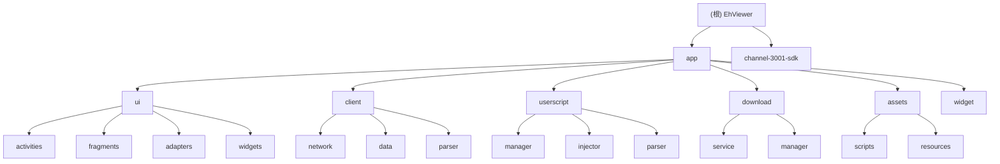

# EhViewer Android 项目文档

> 功能强大的Android图片浏览器应用，集成完整浏览器功能、用户脚本系统、文件管理等特性

## 变更记录 (Changelog)

### 2025-09-04 15:06:50 - 项目架构文档初始化
- 生成项目整体架构文档
- 创建模块结构图和索引
- 建立AI上下文管理系统

## 项目愿景

EhViewer是一个多功能的Android应用，主要专注于：
- **图片浏览**：高效的画廊浏览和管理体验
- **内置浏览器**：功能完整的WebView浏览器，支持各种网页标准
- **用户脚本系统**：类似Tampermonkey的脚本管理，支持网站增强和自定义功能
- **文件管理**：支持多种文件格式的查看和管理
- **渠道定制**：支持多渠道打包和统计分析

## 架构总览

### 技术栈
- **语言**: Java + Kotlin
- **平台**: Android (minSdk 23, targetSdk 29, compileSdk 35)
- **架构模式**: MVP + Repository Pattern
- **UI框架**: AndroidX + Material Design
- **网络**: OkHttp3 + 自定义DNS和代理
- **数据库**: GreenDAO
- **浏览器内核**: 腾讯X5 WebView + 原生WebView
- **分析**: Firebase Analytics + Crashlytics

### 架构分层
```
┌─────────────────────────────────────┐
│           UI Layer                   │
│  Activities │ Fragments │ Views      │
├─────────────────────────────────────┤
│         Business Layer              │
│  Managers │ Services │ Controllers   │
├─────────────────────────────────────┤
│          Data Layer                 │
│  Database │ Network │ Cache │ Files │
├─────────────────────────────────────┤
│         Native Layer                │
│    JNI │ C++ Components │ NDK       │
└─────────────────────────────────────┘
```

## 模块结构图



## 模块索引

| 模块路径 | 职责描述 | 主要组件 | 状态 |
|---------|---------|---------|------|
| **app** | 主应用模块 | EhApplication, MainActivity, WebViewActivity | ✅ 活跃 |
| **app/ui** | 用户界面层 | Activities, Fragments, Adapters | ✅ 活跃 |
| **app/client** | 网络客户端层 | EhClient, CookieStore, SSLFactory | ✅ 活跃 |
| **app/userscript** | 用户脚本系统 | UserScriptManager, ScriptInjector | ✅ 活跃 |
| **app/download** | 下载管理系统 | DownloadManager, DownloadService | ✅ 活跃 |
| **app/assets** | 内置脚本资源 | 15个预置增强脚本 | ✅ 活跃 |
| **channel-3001-sdk** | 渠道SDK | 渠道统计分析 | ✅ 活跃 |

## 核心特性

### 🌐 内置浏览器功能
- 完整WebView浏览器实现
- 支持HTTP/HTTPS及各种URL协议 
- 智能地址栏和搜索建议
- 书签和历史记录管理
- 多标签页支持
- 密码自动填充

### 🔧 用户脚本系统
- Tampermonkey风格的脚本管理
- 脚本注入和执行引擎
- 15个预置网站增强脚本
- 脚本自动更新机制
- 支持JavaScript ES6+

### 📱 多媒体文件支持
- 图片查看器 (支持各种格式)
- 视频/音频播放器
- 文档查看器 (PDF, Office等)
- 压缩包查看器
- APK安装器

### 📂 文件管理器
- 完整的文件浏览功能
- 支持各种文件操作
- 集成媒体预览
- 云存储支持

## 运行与开发

### 环境要求
- Android Studio Arctic Fox+
- JDK 17
- Android SDK 35
- NDK (用于native组件)

### 构建步骤
```bash
# 克隆项目
git clone <repository-url>
cd EhViewerh

# 清理构建
./gradlew clean

# 构建Debug版本
./gradlew assembleDebug

# 构建Release版本 (带签名)
./gradlew assembleRelease
```

### 渠道配置
在 `app/build.gradle.kts` 中修改 `CHANNEL_CODE` 来切换渠道：
```kotlin
buildConfigField("String", "CHANNEL_CODE", "\"3001\"")
```

### 重要提醒
⚠️ **APK必须带签名才能安装** - 使用 `assembleRelease` 而不是 `assembleAppReleaseRelease`

## 测试策略

### 单元测试
- 位置: `app/src/test/`
- 框架: JUnit 4 + Robolectric
- 覆盖: 核心业务逻辑

### 集成测试  
- 位置: `app/src/androidTest/`
- 框架: Espresso
- 覆盖: UI交互测试

### 测试执行
```bash
# 运行单元测试
./gradlew test

# 运行集成测试 (需要设备/模拟器)
./gradlew connectedAndroidTest
```

## 编码规范

### Java/Kotlin规范
- 遵循Android官方代码风格
- 使用AndroidX库而非Support库
- 优先使用Kotlin进行新功能开发
- Activity名称以Activity结尾
- Fragment名称以Fragment结尾

### 资源命名
- Activity布局: `activity_*.xml`
- Fragment布局: `fragment_*.xml` 
- 控件布局: `widget_*.xml`
- 图标资源: `ic_*.xml`
- 颜色资源: 使用语义化命名

### 架构原则
- 严格分离UI与业务逻辑
- 使用Repository模式管理数据
- 通过Manager类封装复杂业务
- Service用于后台长期任务
- 使用EventBus进行组件通信

## AI使用指引

### 上下文优化
- 本项目已配置AI上下文管理系统
- 使用 `.claude/index.json` 快速了解项目结构
- 重要配置信息已在 `CLAUDE.md` 中记录

### 开发建议
1. **修改前必读**: 先查看相关模块的CLAUDE.md文档
2. **测试驱动**: 修改功能时同步更新测试用例
3. **渐进式开发**: 优先修改现有代码而非新建文件
4. **文档同步**: 重要更改需更新对应文档

### 关键约束
- 🚫 不要修改核心业务逻辑除非确实必要
- 🚫 不要添加不必要的依赖库
- 🚫 不要破坏现有的用户脚本兼容性
- ✅ 优先使用已有的工具类和组件
- ✅ 保持代码风格一致性

## 变更记录 (Changelog)

### v1.9.9.19 (当前版本)
- 完善浏览器功能和用户脚本系统
- 增强文件管理器功能
- 优化渠道统计和分析
- 修复已知问题和性能优化

---

*本文档由AI辅助生成 - 最后更新: 2025-09-04*