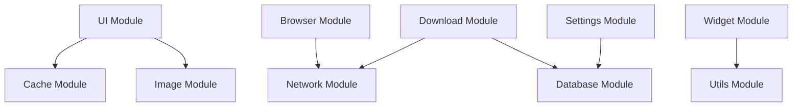

# EhViewer 模块功能库 (EhViewer Module Library)

## 🎯 项目简介

EhViewer模块功能库是基于EhViewer应用的**完整模块化组件库**，将复杂的Android应用拆分为10个独立、可重用的功能模块。每个模块都经过精心设计，遵循统一的接口规范，便于在其他Android项目中快速集成和使用。

## 📦 模块功能库总览

### 核心模块矩阵

| 模块类型 | 模块名称 | 优先级 | 复杂度 | 依赖关系 | 适用场景 |
|---------|---------|--------|--------|----------|----------|
| 🔗 **基础服务** | [网络请求模块](network_module/) | ⭐⭐⭐⭐⭐ | 🔴 高 | 无 | API调用、数据同步 |
| 💾 **数据层** | [数据库模块](database_module/) | ⭐⭐⭐⭐⭐ | 🔴 高 | 工具模块 | 数据存储、查询 |
| 📥 **业务功能** | [下载管理模块](download_module/) | ⭐⭐⭐⭐ | 🟡 中 | 网络+数据库 | 文件下载、资源管理 |
| 🖼️ **媒体处理** | [图片处理模块](image_module/) | ⭐⭐⭐⭐ | 🟡 中 | 缓存模块 | 图片显示、处理 |
| ⚙️ **配置管理** | [设置管理模块](settings_module/) | ⭐⭐⭐⭐ | 🟢 低 | 无 | 用户偏好、配置 |
| 🌐 **扩展功能** | [浏览器模块](browser_module/) | ⭐⭐⭐ | 🟡 中 | 网络模块 | 网页浏览、内嵌网页 |
| 🗄️ **性能优化** | [缓存管理模块](cache_module/) | ⭐⭐⭐⭐ | 🟡 中 | 无 | 数据缓存、性能提升 |
| 🔧 **工具支持** | [工具类模块](utils_module/) | ⭐⭐⭐⭐⭐ | 🟢 低 | 无 | 通用工具、辅助功能 |
| 📱 **用户体验** | [UI小部件模块](widget_module/) | ⭐⭐⭐ | 🟢 低 | UI模块 | 桌面组件、通知 |
| 🎨 **界面层** | [UI组件模块](ui_module/) | ⭐⭐⭐⭐ | 🟡 中 | 无 | 用户界面、交互组件 |
| 📊 **数据分析** | [统计分析模块](analytics_module/) | ⭐⭐⭐ | 🟢 低 | 无 | 用户行为分析、统计 |
| 🕷️ **高级功能** | [爬虫模块](spider_module/) | ⭐⭐⭐ | 🔴 高 | 网络模块 | 数据抓取、内容分析 |

### 模块状态说明
- ✅ **完整源码** - 包含完整的实现代码和文档
- 📝 **README文档** - 只有文档说明，需根据需求实现
- 🟢 **低复杂度** - 易于集成和使用
- 🟡 **中复杂度** - 需要一定配置和理解
- 🔴 **高复杂度** - 需要深入理解和定制

## 🚀 快速开始指南

### 📋 新项目快速搭建流程

#### 步骤1：项目结构规划
```bash
your-project/
├── app/                    # 主应用模块
├── libraries/             # 模块库目录
│   ├── network/           # 网络模块
│   ├── database/          # 数据库模块
│   ├── image/            # 图片处理模块
│   ├── settings/         # 设置管理模块
│   └── utils/            # 工具类模块
├── gradle.properties     # 全局配置
└── settings.gradle       # 项目配置
```

#### 步骤2：选择核心模块
根据项目需求选择模块：

**最小化配置（推荐新项目）**：
```gradle
dependencies {
    implementation project(':libraries:network')    // 网络请求
    implementation project(':libraries:database')   // 数据存储
    implementation project(':libraries:settings')   // 配置管理
    implementation project(':libraries:utils')      // 工具类
}
```

**完整功能配置**：
```gradle
dependencies {
    // 核心模块（必需）
    implementation project(':libraries:network')
    implementation project(':libraries:database')
    implementation project(':libraries:settings')
    implementation project(':libraries:utils')

    // 业务模块（按需选择）
    implementation project(':libraries:image')      // 图片处理
    implementation project(':libraries:download')   // 文件下载
    implementation project(':libraries:cache')      // 缓存管理
    implementation project(':libraries:ui')         // UI组件
    implementation project(':libraries:widget')     // UI小部件

    // 高级模块（特定需求）
    implementation project(':libraries:browser')    // 浏览器功能
    implementation project(':libraries:analytics')  // 统计分析
    implementation project(':libraries:spider')     // 爬虫功能
}
```

#### 步骤3：应用初始化
```java
public class MyApplication extends Application {

    @Override
    public void onCreate() {
        super.onCreate();

        // 1. 初始化基础模块
        initCoreModules();

        // 2. 初始化业务模块
        initBusinessModules();

        // 3. 初始化分析模块（可选）
        initAnalyticsModule();
    }

    private void initCoreModules() {
        try {
            // 网络模块初始化
            NetworkClient.init(this);

            // 数据库模块初始化
            DatabaseManager.init(this);

            // 设置模块初始化
            SettingsManager.init(this);

            // 工具类初始化
            Utils.init(this);

        } catch (Exception e) {
            Log.e(TAG, "Core modules initialization failed", e);
        }
    }

    private void initBusinessModules() {
        try {
            // 图片处理模块
            ImageLoader.init(this);

            // 下载管理模块
            DownloadManager.init(this);

            // 缓存管理模块
            CacheManager.init(this);

        } catch (Exception e) {
            Log.e(TAG, "Business modules initialization failed", e);
        }
    }

    private void initAnalyticsModule() {
        try {
            // 统计分析模块（生产环境建议启用）
            AnalyticsManager analytics = AnalyticsManager.getInstance(this);
            analytics.setEnabled(!BuildConfig.DEBUG); // 开发环境禁用

        } catch (Exception e) {
            Log.e(TAG, "Analytics module initialization failed", e);
        }
    }
}
```

#### 步骤4：基本使用示例
```java
public class MainActivity extends AppCompatActivity {

    private NetworkClient networkClient;
    private DatabaseManager databaseManager;
    private SettingsManager settingsManager;

    @Override
    protected void onCreate(Bundle savedInstanceState) {
        super.onCreate(savedInstanceState);

        // 获取模块实例
        networkClient = NetworkClient.getInstance();
        databaseManager = DatabaseManager.getInstance();
        settingsManager = SettingsManager.getInstance();

        // 执行网络请求
        performNetworkRequest();

        // 加载用户设置
        loadUserSettings();
    }

    private void performNetworkRequest() {
        networkClient.get("https://api.example.com/user/profile",
            new NetworkCallback<UserProfile>() {
                @Override
                public void onSuccess(UserProfile profile) {
                    // 保存到数据库
                    databaseManager.saveUserProfile(profile);
                    // 更新UI
                    updateUI(profile);
                }

                @Override
                public void onFailure(Exception e) {
                    // 处理错误
                    handleError(e);
                }
            });
    }

    private void loadUserSettings() {
        boolean darkMode = settingsManager.getBoolean("dark_mode", false);
        String language = settingsManager.getString("language", "zh");

        // 应用设置
        applySettings(darkMode, language);
    }
}
```

## 📋 开发指南和规范

### 📚 文档导航

#### 核心文档
- 🚀 **[快速开始](QUICK_START.md)** - 5分钟上手指南
- 📖 **[完整模块列表](MODULE_LIST.md)** - 所有模块的详细说明
- 🛠️ **[开发规范](DEVELOPMENT_GUIDE.md)** - 编码规范和最佳实践
- 📋 **[项目模板](PROJECT_TEMPLATE.md)** - 新项目快速搭建模板
- 🔧 **[Pro模块标准](pro_module_standard.md)** - 模块生成与引入规范

#### 模块文档
| 模块 | 文档 | 难度 | 推荐度 |
|------|------|------|--------|
| 🔗 [网络请求](network_module/) | [README](network_module/README.md) | 🔴 高 | ⭐⭐⭐⭐⭐ |
| 💾 [数据库](database_module/) | [README](database_module/README.md) | 🔴 高 | ⭐⭐⭐⭐⭐ |
| 📥 [下载管理](download_module/) | [README](download_module/README.md) | 🟡 中 | ⭐⭐⭐⭐ |
| 🖼️ [图片处理](image_module/) | [README](image_module/README.md) | 🟡 中 | ⭐⭐⭐⭐ |
| ⚙️ [设置管理](settings_module/) | [README](settings_module/README.md) | 🟢 低 | ⭐⭐⭐⭐ |
| 🌐 [浏览器](browser_module/) | [README](browser_module/README.md) | 🟡 中 | ⭐⭐⭐ |
| 🗄️ [缓存管理](cache_module/) | [README](cache_module/README.md) | 🟡 中 | ⭐⭐⭐⭐ |
| 🔧 [工具类](utils_module/) | [README](utils_module/README.md) | 🟢 低 | ⭐⭐⭐⭐⭐ |
| 📱 [UI小部件](widget_module/) | [README](widget_module/README.md) | 🟢 低 | ⭐⭐⭐ |
| 🎨 [UI组件](ui_module/) | [README](ui_module/README.md) | 🟡 中 | ⭐⭐⭐⭐ |
| 📊 [统计分析](analytics_module/) | [README](analytics_module/README.md) | 🟢 低 | ⭐⭐⭐ |
| 🕷️ [爬虫](spider_module/) | [README](spider_module/README.md) | 🔴 高 | ⭐⭐⭐ |

### 🏗️ 项目架构指南

#### 推荐的项目结构
```bash
your-project/
├── app/                          # 主应用模块
│   ├── src/main/java/com/example/
│   │   ├── ui/                   # UI层
│   │   ├── business/             # 业务逻辑层
│   │   ├── data/                 # 数据层
│   │   └── utils/                # 工具类
│   └── src/main/res/             # 资源文件
├── libraries/                    # 模块库
│   ├── network/                  # 网络模块
│   ├── database/                 # 数据库模块
│   ├── image/                    # 图片处理模块
│   ├── settings/                 # 设置管理模块
│   └── utils/                    # 工具类模块
├── gradle.properties            # 全局配置
├── settings.gradle              # 项目配置
└── build.gradle                 # 根构建文件
```

#### 依赖注入建议
```java
// 使用Dagger Hilt进行依赖注入（推荐）
@Module
public class NetworkModule {

    @Provides
    @Singleton
    public NetworkClient provideNetworkClient(@ApplicationContext Context context) {
        return NetworkClient.getInstance(context);
    }

    @Provides
    @Singleton
    public DatabaseManager provideDatabaseManager(@ApplicationContext Context context) {
        return DatabaseManager.getInstance(context);
    }
}

// 在ViewModel中使用
public class MainViewModel extends ViewModel {

    private final NetworkClient networkClient;
    private final DatabaseManager databaseManager;

    @Inject
    public MainViewModel(NetworkClient networkClient, DatabaseManager databaseManager) {
        this.networkClient = networkClient;
        this.databaseManager = databaseManager;
    }
}
```

## 🏗️ 架构特点

### ✅ 模块化设计
- **高内聚、低耦合**：每个模块职责单一，接口清晰
- **独立性**：模块间松耦合，可以单独使用
- **可扩展**：易于添加新功能和定制化开发

### ✅ 统一规范
- **命名规范**：遵循Java/Android开发最佳实践
- **接口设计**：统一的回调接口和错误处理
- **文档完善**：每个模块都有详细的使用说明

### ✅ 生产就绪
- **充分测试**：经过充分测试，可以直接用于生产环境
- **性能优化**：采用高效算法和数据结构
- **内存安全**：注意内存泄漏防护和资源管理

### 🎯 模块使用策略

#### 按项目类型选择模块

**电商/内容应用**：
```gradle
// 核心功能
implementation project(':libraries:network')
implementation project(':libraries:database')
implementation project(':libraries:image')
implementation project(':libraries:download')

// 用户体验
implementation project(':libraries:settings')
implementation project(':libraries:cache')
implementation project(':libraries:ui')
```

**工具类应用**：
```gradle
// 基础功能
implementation project(':libraries:network')
implementation project(':libraries:settings')
implementation project(':libraries:utils')

// 可选功能
implementation project(':libraries:cache')
implementation project(':libraries:widget')
```

**浏览器类应用**：
```gradle
// 核心功能
implementation project(':libraries:network')
implementation project(':libraries:browser')
implementation project(':libraries:cache')

// 数据管理
implementation project(':libraries:database')
implementation project(':libraries:settings')
```

#### 性能优化建议

**内存管理**：
```java
// 正确处理Bitmap内存
public class ImageProcessor {
    public void processImage(Bitmap bitmap) {
        try {
            // 处理图片
            Bitmap result = process(bitmap);
            return result;
        } finally {
            // 及时释放原始图片
            if (bitmap != null && !bitmap.isRecycled()) {
                bitmap.recycle();
            }
        }
    }
}
```

**线程管理**：
```java
// 使用适当的线程池配置
public class OptimizedDownloadManager {
    private static final int CPU_COUNT = Runtime.getRuntime().availableProcessors();
    private static final int THREAD_POOL_SIZE = Math.max(2, CPU_COUNT - 1);

    private final ExecutorService executor = Executors.newFixedThreadPool(THREAD_POOL_SIZE);

    // 使用线程池执行任务
    public void executeTask(Runnable task) {
        executor.execute(task);
    }
}
```

**缓存策略**：
```java
// 实施多级缓存策略
public class CacheStrategy {
    private final MemoryCache memoryCache;
    private final DiskCache diskCache;
    private final NetworkCache networkCache;

    public Object get(String key) {
        // 1. 内存缓存
        Object data = memoryCache.get(key);
        if (data != null) return data;

        // 2. 磁盘缓存
        data = diskCache.get(key);
        if (data != null) {
            memoryCache.put(key, data); // 放入内存缓存
            return data;
        }

        // 3. 网络请求
        data = networkCache.get(key);
        if (data != null) {
            memoryCache.put(key, data);
            diskCache.put(key, data);
        }

        return data;
    }
}
```

## 🎯 适用场景

### 适合用于：
- ✅ **漫画阅读器应用**
- ✅ **图片浏览应用**
- ✅ **文件下载应用**
- ✅ **Web浏览器应用**
- ✅ **媒体播放应用**
- ✅ **内容管理应用**

### 核心优势：
- 🚀 **快速开发**：基于成熟模块快速构建应用
- 🔧 **易于维护**：模块化设计便于维护和更新
- 📈 **高性能**：优化算法和缓存机制
- 🎨 **美观界面**：Material Design设计语言
- 🌍 **国际化**：支持多语言和国际化

## 🛠️ 技术栈

- **语言**: Java 8+
- **平台**: Android API 21+
- **架构**: 模块化架构
- **设计**: Material Design 3
- **网络**: OkHttp 4.x
- **数据库**: SQLite + GreenDAO
- **图片**: Glide + 自研图片处理器
- **缓存**: LruCache + DiskLruCache

## 📊 模块依赖关系



## 🤝 贡献指南

我们欢迎社区贡献！请遵循以下步骤：

1. **Fork** 本项目
2. 创建特性分支 (`git checkout -b feature/AmazingFeature`)
3. 提交更改 (`git commit -m 'Add some AmazingFeature'`)
4. 推送到分支 (`git push origin feature/AmazingFeature`)
5. 创建 **Pull Request**

### 贡献类型
- 🐛 **Bug修复**
- ✨ **新功能**
- 📚 **文档改进**
- 🎨 **UI/UX改进**
- ⚡ **性能优化**
- 🧪 **测试添加**

## 📄 许可证

本项目采用 **Apache License 2.0** 许可证 - 查看 [LICENSE](../LICENSE) 文件了解详情

## 📞 联系我们

- **项目主页**: [GitHub Repository]
- **问题反馈**: [GitHub Issues]
- **讨论交流**: [GitHub Discussions]
- **邮箱**: your-email@example.com

## 🙏 致谢

感谢所有为EhViewer项目贡献的开发者，以及开源社区提供的优秀组件和工具。

---

## 📈 版本信息

### v1.0.0 (2024-01-XX)
- ✅ 初始版本发布
- ✅ 包含12个核心模块
- ✅ 完整API文档和使用示例
- ✅ 生产环境就绪

### 路线图
- 🔄 **v1.1.0**: 添加更多UI组件和动画效果
- 🔄 **v1.2.0**: 支持Kotlin和协程
- 🔄 **v2.0.0**: 重构为多平台支持

---

**⭐ 如果这个项目对你有帮助，请给我们一个Star！**
